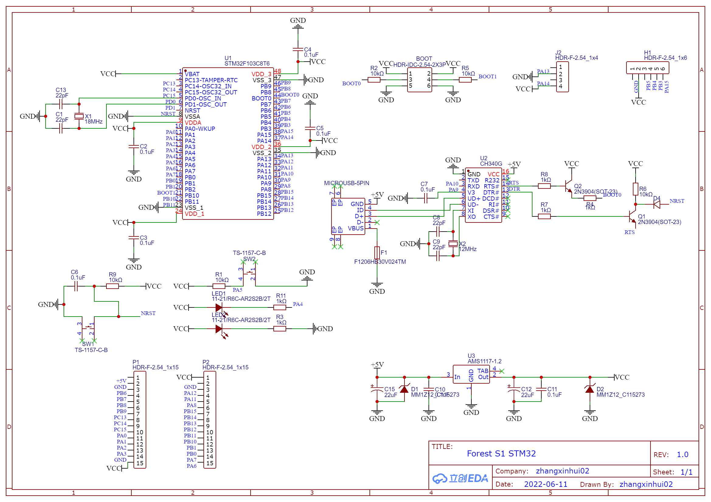
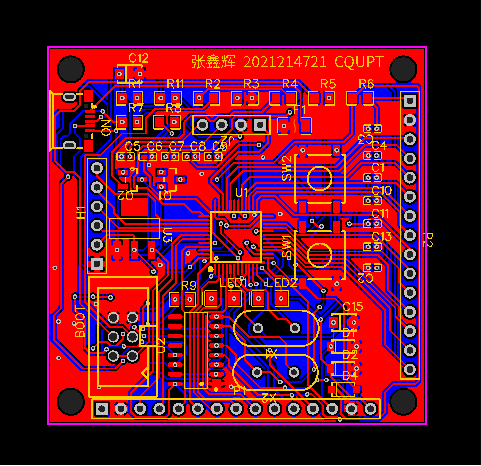
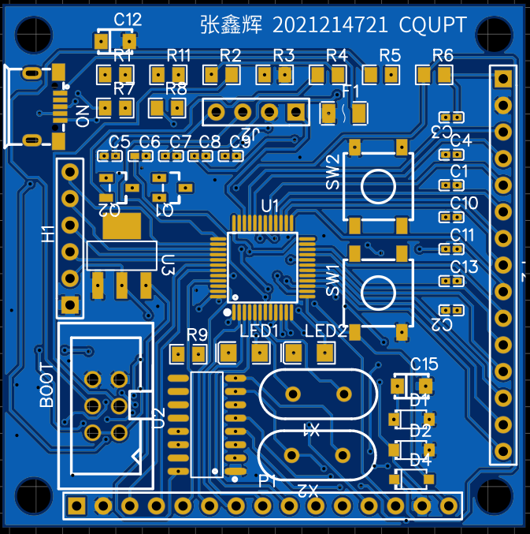
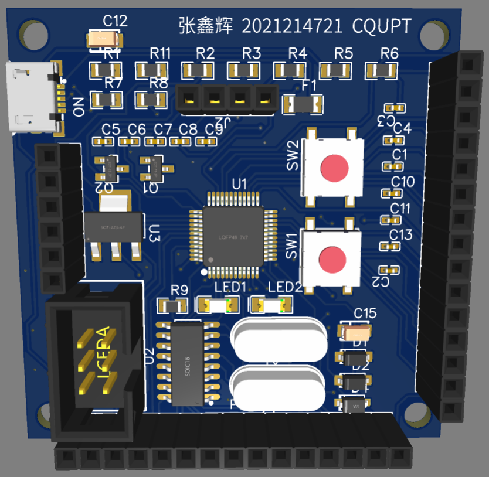

# 硬件基础试题

[题目](./HardwareQuestion.pdf)

[附件：Forest_S1_STM32最小系统原理图](./Forest_S1_ STM32.pdf)

---

使用立创EDA软件完成了本题目。

部分元件由于不太熟悉选取有误，不过功能一致不影响使用。

---

Forest S1 STM32最小系统原理图：

[原理图PDF](./diagram/Schematic_ForestS1STM32.pdf)

---

Forest S1 STM32最小系统PCB：

[PCB DXF文件](./diagram/PCB_ForestS1STM32.dxf)

[PCBDOC文件](./diagram/PCB_ForestS1STM32.pcbdoc)

[PCB PDF文件](./diagram/PCB_PCB_ForestS1STM32.pdf)

[PCB 立创EDA格式文件](./diagram/PCB_PCB_ForestS1STM32.json)

---